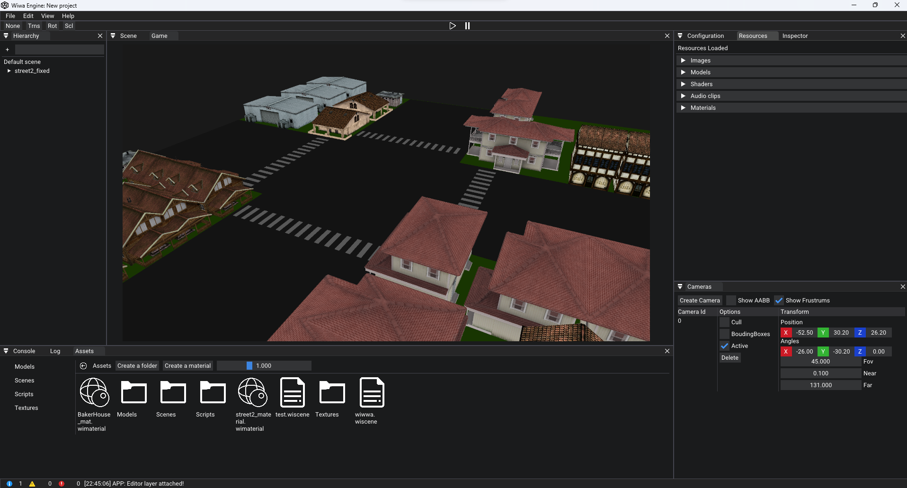
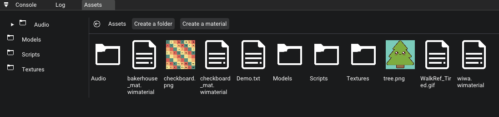
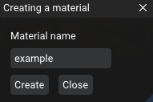
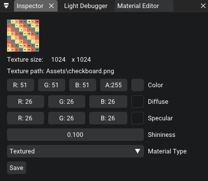

#  Wiwa Engine



## About the project

Wiwa engine is a 3D Game Engine developed during the Game Engines subject. Our goal is to fulfill an Engine that can be used to develop all kinds of games. The engine is based on a full ECS system, and it's meant to have modern features as PBR and C# scripting.

[Github](https://github.com/ZaroDev/WiwaEngine)
[Latest Release](https://github.com/ZaroDev/WiwaEngine/releases)

## Info

For now the engine has the following features.

- Reflection
- Entites
- Components
- WIP material system
- WIP basic lighting
- FBX model loading
- PNG texture loading

## Authors

Currently we are two students working on the project

- Víctor Falcón [@ZaroDev](https://github.com/ZaroDev)
- Pablo Llorente [@Xymaru](https://github.com/Xymaru)

## Installing

In order to install the project you can

```git clone https://github.com/ZaroDev/WiwaEngine```

## Compiling

Dependencies:

- Visual Studio 2019 or more

Open the **``Scripts``** folder and then select your Visual Studio version at **``GenerateProjectsX.bat``**
Create a **``Assets``** folder at the **``Editor``** folder

Advise: the project only supports Windows

## How to use

### Entities

To create an entity left click on the Hierarchy window and select an option. You can create either a blank entity or a primitive. (Disclaimer: empty entities do not include any component and they must be added as desired)

### Camera

- Hold right click to look  
- Right click + WASD to move
- F to focus the selected entity
- Alt + right click to orbit an entity
- Alt + Q to quit the app
- Q to unselect the current gizmo
- W to move an object
- E to rotate an object (WIP)
- R to scale

### Materials

To create a material click the button Create Material at the Assets window.


Assing a name to the material and click create.



Open the material editor window and select a material you want to edit.


## MIT License

Copyright (c) 2022 Xymaru & ZaroDev

Permission is hereby granted, free of charge, to any person obtaining a copy
of this software and associated documentation files (the "Software"), to deal
in the Software without restriction, including without limitation the rights
to use, copy, modify, merge, publish, distribute, sublicense, and/or sell
copies of the Software, and to permit persons to whom the Software is
furnished to do so, subject to the following conditions:

The above copyright notice and this permission notice shall be included in all
copies or substantial portions of the Software.

THE SOFTWARE IS PROVIDED "AS IS", WITHOUT WARRANTY OF ANY KIND, EXPRESS OR
IMPLIED, INCLUDING BUT NOT LIMITED TO THE WARRANTIES OF MERCHANTABILITY,
FITNESS FOR A PARTICULAR PURPOSE AND NONINFRINGEMENT. IN NO EVENT SHALL THE
AUTHORS OR COPYRIGHT HOLDERS BE LIABLE FOR ANY CLAIM, DAMAGES OR OTHER
LIABILITY, WHETHER IN AN ACTION OF CONTRACT, TORT OR OTHERWISE, ARISING FROM,
OUT OF OR IN CONNECTION WITH THE SOFTWARE OR THE USE OR OTHER DEALINGS IN THE
SOFTWARE.
